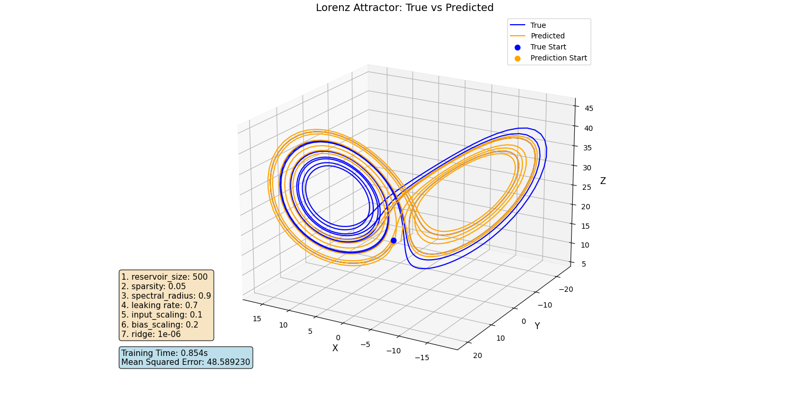

# Reservoir-Computing

I'm using Echo State Network to predict the Lorenz System. Here's my current result:

References:  
[1] D. J. Gauthier, E. Bollt, A. Griffith, and W. A. Barbosa, Next generation reservoir computing, Nature communications, vol. 12, no. 1, pp.
1–8, 2021.  
[2] Mantas Lukoševičius, A practical guide to applying echo state networks Neural Networks: Tricks of the Trade, Springer, pp. 659–86, 2012